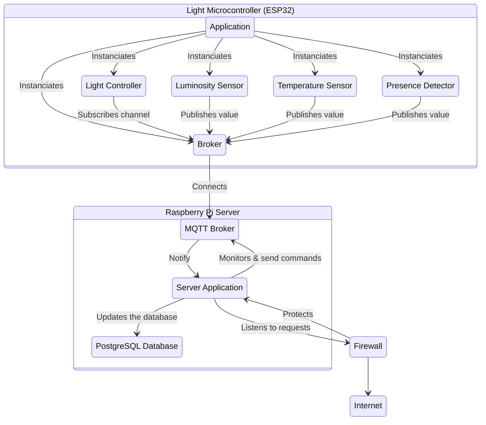
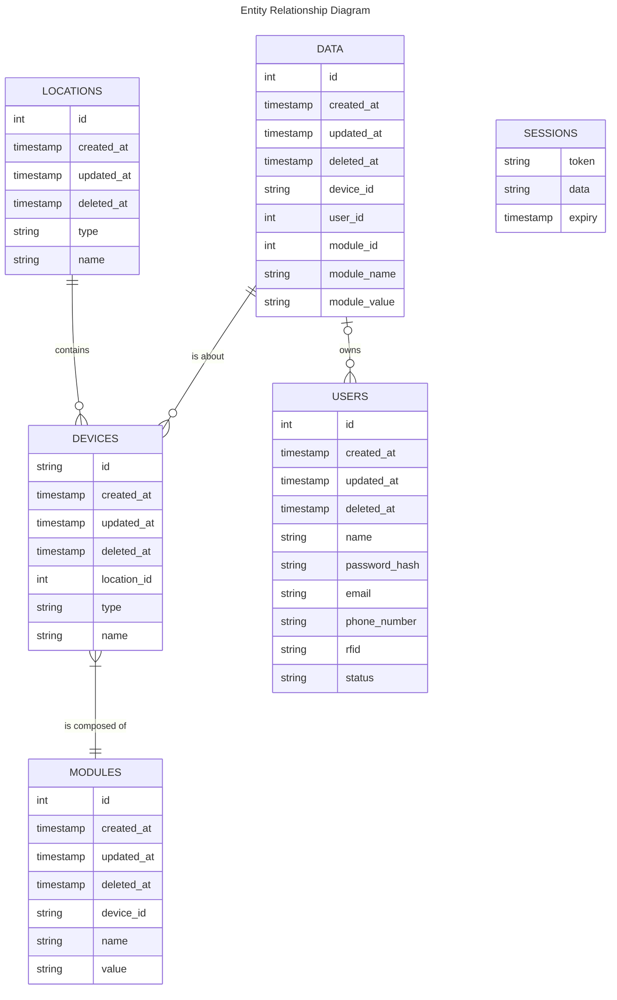
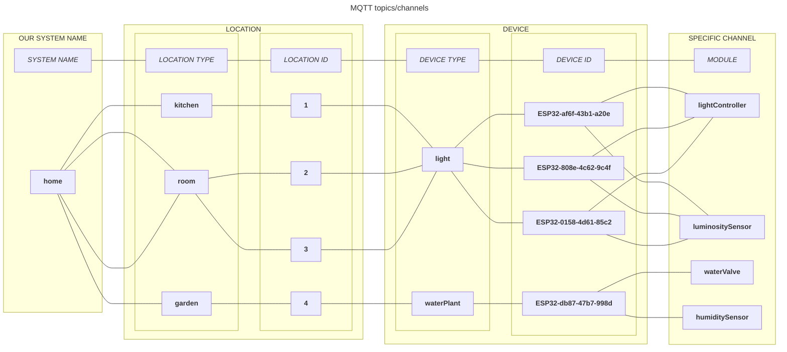
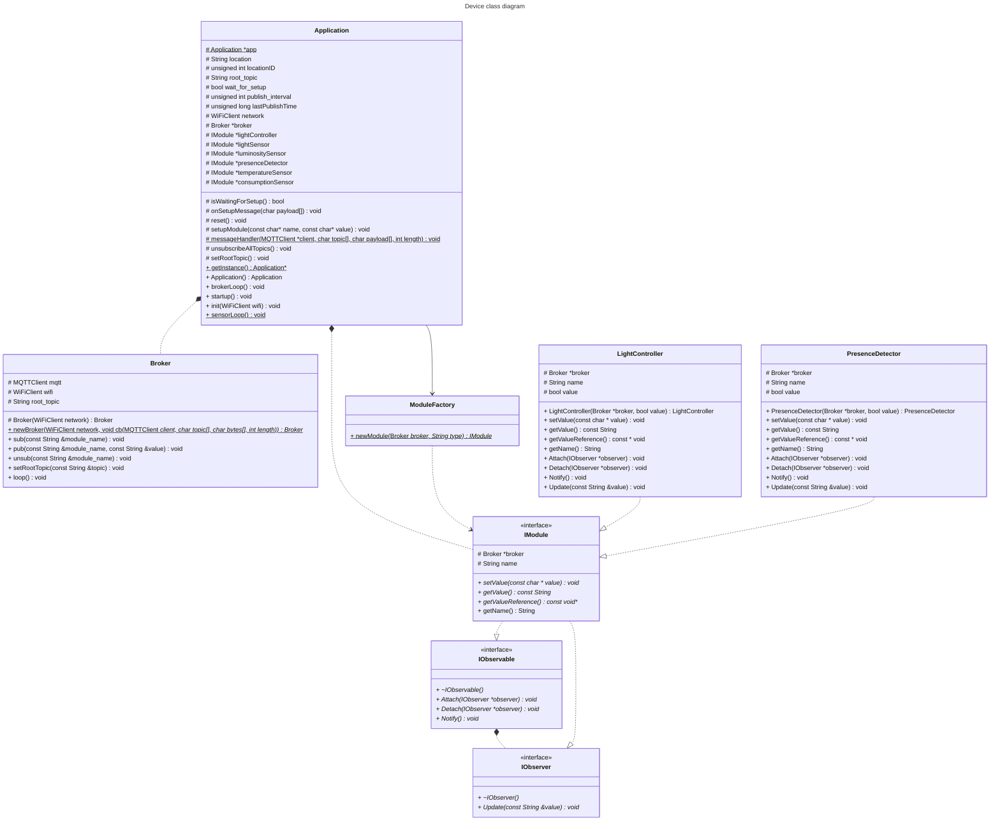
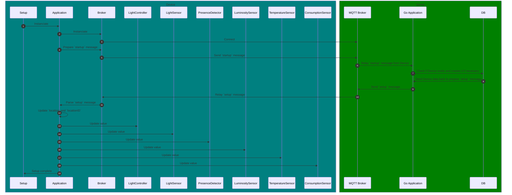

---

## Presentation

This project is made by Computer Science students for an assignment involving a client application, in this case a website, and a real time interaction with the physical world via ESP32 boards.

**Home&Co** _(Co for Connect, Control, Company)_ is a project using **ESP32** dev boards and a **Raspberry Pi 3B+** to monitor, control and automate home appliances like the lights, heaters, front door, water valves for watering plants, etc.

Its objectives are to provide **security**, **control**, **comfort**, **peace of mind** and **energy saving** to your home.

### 1. Security

Our front door device will control the access policy of the front door of your home:
- **RFID** sensor needing a **badge** to open the door
- **bell button** ringing the bell and **notifying you on your phone**
- **locking mechanism** controlled **remotely** (no need to give keys to anybody)
- **presence detector** to **monitor** the activity in front of the door
- **house locking function** to **automatically turn off** all the lights and use all presence detectors as **intrusion detectors**

### 2. Control

You can use the website to **remotely control at any time** the _lights_, the _door_, the _heaters_ and the _watering of plants_.

You have the **full control of your house** from any device.

### 3. Comfort

You can **automate the heaters** to activate at any time of the day, to find a warm house when coming back from a hike, vacation or any activity.

### 4. Peace of mind

You won't have to go through your checklist three times or ask your neighbour to water your plants before going out!

You can **monitor your house from any device** using the website in **real time**: from the _presence detectors_ to the _lights_, _heaters_, _humidity of the plants_ and _temperature of any room_.

### 5. Energy saving

No need to keep heating your home when you're not there!

You'll be able to control and monitor the **heaters** remotely and according to your needs and presence at home.

You'll also be able to **monitor the energy of specific high consumption appliances** with our **smart power outlet** and control them remotely, and even give them schedules to be working or not.


## How it works

### Needs analysis

- **Goal**: fully functional home with remote control (from the web browser)
- **Security Constraint**: no direct access to ESP32 microcontrollers with their sensors and actuators, to database, MQTT or backend application.
- **Components**:
  - Raspberry Pi 3 or more for Wi-Fi access point, MQTT, backend app and webserver.
  - ESP32 for sensors & actuators

### Technical choices

- **Golang** for the backend app and webserver with GORM:
	- Golang is an excellent choice for building efficient, concurrent applications due to its simplicity and strong type system.
    - The Go standard library is comprehensive, making it easy to handle tasks like networking, file I/O, and concurrency.
    - GORM, a popular ORM for Golang, simplifies database interactions by providing a clean and intuitive API.

- **PostgreSQL** for the database:
	- PostgreSQL is an advanced, open source relational database management system known for its robustness, scalability, and ACID compliance.
    - It offers features like transactions, indexing, and support for complex data types, making it ideal for handling diverse and large-scale applications.

- **Mosquitto** for the MQTT broker:
	- Mosquitto is a lightweight, open source MQTT broker that's highly reliable and easy to configure.
    - Its simplicity and performance make it an excellent choice for real-time communication between devices and services, especially in scenarios where low latency and high availability are crucial.

- **RaspAP** for the Wi-Fi Access Point in the Raspberry Pi:
  - RaspAP provides a user-friendly interface for setting up and managing a Wi-Fi access point on a Raspberry Pi.
  - It simplifies the process of configuring network settings, security protocols, and other related tasks, making it accessible even to users with limited technical expertise.

- **Websocket** between JavaScript clients and Golang server:
  - Websockets provide full-duplex communication channels over a single TCP connection, enabling real-time data exchange between the frontend and backend.
  - This is particularly useful for applications requiring immediate updates and interactions, such as chat applications or live dashboards.

- **PlatformIO** and **C**/**C++** for the ESP32:
	- PlatformIO offers a unified development environment for embedded systems, making it easy to manage multiple projects and boards.
    - It supports a wide range of platforms and tools, including C/C++, which is ideal for writing efficient and low-level code for microcontrollers like the ESP32.

### Basic features

- Monitoring sensors with the web interface
- Controlling actuators from the web interface
- Data collection in the database
- Light and temperature management

### Additional features (future release)

- Front door monitoring with `RFID` badge
- Energy consumption management
- Shutter and window management
- Fire and smoke detection
- Alarm mode
- Ventilation management
- Scheduler for actuators (heaters, light, shutters, ventilation)
- Statistics and prevision dashboards

### Components architecture

#### Overall Infrastructure



#### Database



#### MQTT



#### Web Server file architecture

```
├── cmd
│   └── web
│       ├── context.go
│       ├── handlers.go
│       ├── helpers.go
│       ├── main.go
│       ├── middleware.go
│       ├── models.go
│       ├── routes.go
│       ├── server.go
│       ├── templates.go
│       └── websocket.go
├── go.mod
├── go.sum
├── internal
│   ├── data
│   │   ├── broker.go
│   │   ├── consumption-sensor.go
│   │   ├── data.go
│   │   ├── device.go
│   │   ├── imodule.go
│   │   ├── light-controller.go
│   │   ├── light-sensor.go
│   │   ├── location.go
│   │   ├── luminosity-sensor.go
│   │   ├── models.go
│   │   ├── module.go
│   │   ├── presence-detector.go
│   │   ├── reset.go
│   │   ├── startup.go
│   │   ├── subscription.go
│   │   ├── temperature-sensor.go
│   │   └── value-conversion.go
│   ├── mailer
│   │   ├── mailer.go
│   │   └── templates
│   │       └── alert-notification.tmpl
│   └── validator
│       └── validator.go
├── README.md
├── ui
│   ├── assets
│   │   ├── css
│   │   │   ├── base.scss
│   │   │   └── style.scss
│   │   ├── font
│   │   │   ├── Dosis-VariableFont_wght.ttf
│   │   └── img
│   │       └── logo
│   │           └── logo.png
│   ├── efs.go
│   └── templates
│       ├── base.tmpl
│       ├── pages
│       │   ├── dashboard.tmpl
│       │   ├── error.tmpl
│       │   └── home.tmpl
│       └── partials
│           └── partial-example.tmpl
└── vendor
```

#### ESP32 C++ File Architecture

```
├── include
│   ├── Application.h
│   ├── Broker.h
│   ├── ConsumptionSensor.h
│   ├── environment.h
│   ├── IModule.h
│   ├── IObservable.h
│   ├── IObserver.h
│   ├── LightController.h
│   ├── LightSensor.h
│   ├── LuminositySensor.h
│   ├── ModuleFactory.h
│   ├── MyAny.h
│   ├── PresenceDetector.h
│   ├── README
│   ├── TemperatureSensor.h
│   └── utils.h
├── lib
│   ├── README
│   └── xht11
│       ├── xht11.cpp
│       └── xht11.h
├── LICENSE
├── platformio.ini
├── README.md
└── src
   ├── Application.cpp
   ├── Broker.cpp
   ├── ConsumptionSensor.cpp
   ├── HomeIoT.ino
   ├── LightController.cpp
   ├── LightSensor.cpp
   ├── LuminositySensor.cpp
   ├── ModuleFactory.cpp
   ├── PresenceDetector.cpp
   ├── TemperatureSensor.cpp
   └── utils.cpp
```

#### Class diagram



#### Startup / Setup

##### Startup/Setup message
```json
{
  "id": "ESP32-af6f-43b1-a20e",
  "type": "light",
  "location_id": 3,
  "location_type": "room",
  "location_name": "room 3",
  "modules": [
    {
      "name": "lightController",
      "value": "False"
    },
    {
      "name": "lightSensor",
      "value": "True"
    },
    {
      "name": "luminositySensor",
      "value": "150.0"
    },
    {
      "name": "presenceDetector",
      "value": "True"
    },
    {
      "name": "temperatureSensor",
      "value": "22.5"
    },
    {
      "name": "consumptionSensor",
      "value": "32.45"
    }
  ]
}
```

##### Setup sequence diagram



